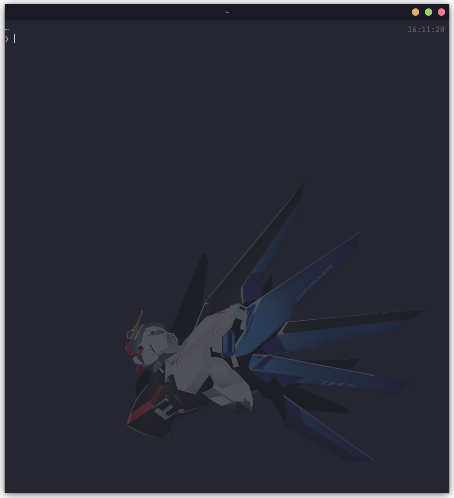

# kitty-bg-freedom

<div style="display: flex">
  <p style="margin: auto">
    Here images were retouched by me for use as the window-logo/background in Kitty terminal.
    <b>The original was not painted by me.</b>
  </p>
  
</div>

## Original

[Freedom Gundam Minimalist Wallpaper](https://www.deviantart.com/cleru087/art/Freedom-Gundam-Minimalist-Wallpaper-435212593)\
by [CLeRu087](https://www.deviantart.com/cleru087)

## Usage Example

### as Window Logo

1. `cp <any> $XDG_CONFIG_HOME/kitty/windowlogo.png`
1. Update `$XDG_CONFIG_HOME/kitty/kitty.conf`:\

   ```kitty
   window_logo_path ./windowlogo.png
   window_logo_alpha 0.2
   # top-left, ..., center, ..., bottom-right
   window_logo_position bottom-right
   background_opacity 0.95
   ```

   - Recommendation `window_logo_alpha` value
     - dark: 0.08 \~ 0.2
     - light: 0.6 \~ 0.7

### as Background

1. `cp <any> $XDG_CONFIG_HOME/kitty/background.png`
1. Update `$XDG_CONFIG_HOME/kitty/kitty.conf`:\
   e.g.

   ```kitty
   background_opacity 0.8
   background_tint 0.7
   background_image ./background.png
   background_image_layout scaled
   background_image_linear no
   ```

## RecommendImages

### Dark theme

- pickup/vignette-overlay/*
- pickup/vignette-overlay-inverse/*
- pickup/vignette-softlight-inverse/*
- extra/freedom_plain-black-transparent_*.png

### Light theme

- pickup/vignette-overlay/*
- pickup/vignette-overlay-inverse/*
- pickup/vignette-softlight-inverse/*
- pickup/vignette-vividlight-inverse/*
- pickup/vignette-subtract-inverse/*
- extra/freedom_plain-white-transparent_*.png

## Extra

- extra/freedom_plain-black-transparent_3200x2800.png
- extra/freedom_plain-black-transparent_1600x1400.png
- extra/freedom_plain-black-transparent_800x700.png
- extra/freedom_plain-white-transparent_3200x2800.png
- extra/freedom_plain-white-transparent_1600x1400.png
- extra/freedom_plain-white-transparent_800x700.png
